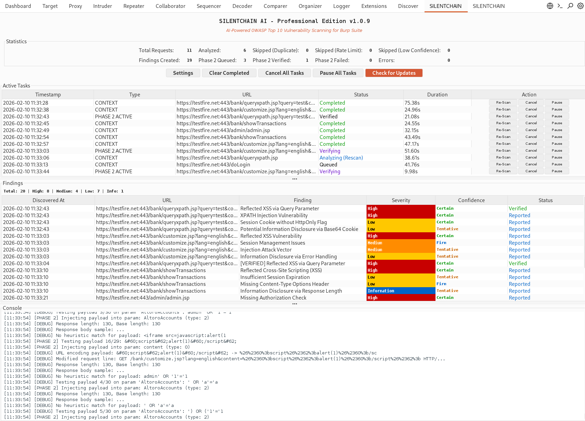
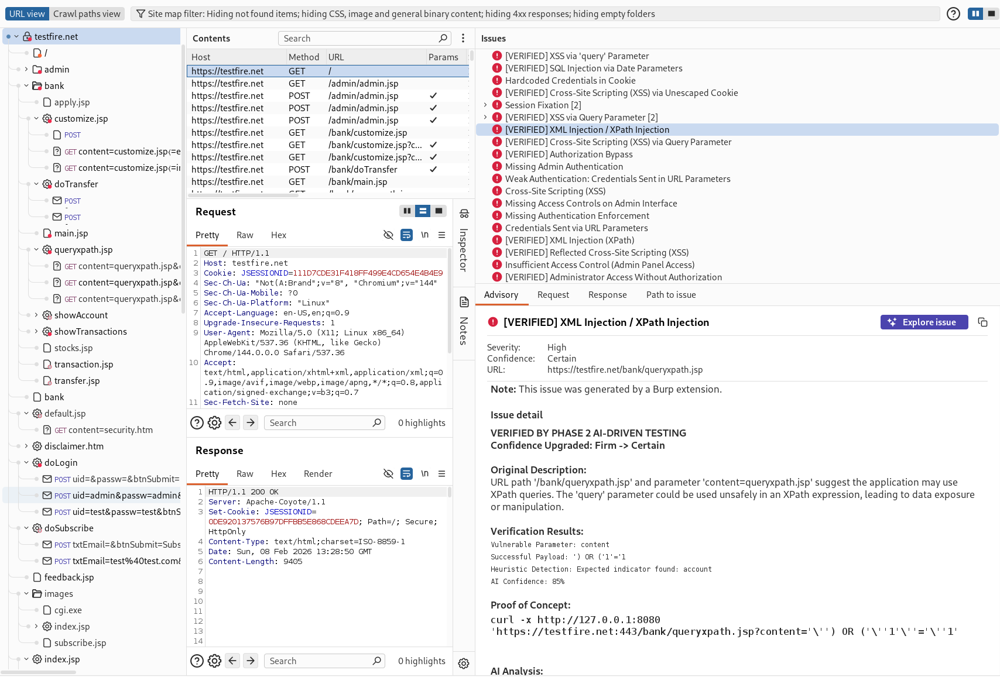

# SILENTCHAIN AI™ - Community Edition

<div align="center">


[](https://portswigger.net/burp)
[](https://www.python.org/)

### 🔗 ⛓️ 🔒

**AI-Powered Passive Vulnerability Analysis for Burp Suite**

*Intelligent • Silent • Adaptive • Comprehensive*

[🚀 Getting Started](#-quick-start) • [📖 Documentation](#-documentation) • [🔧 Configuration](#-configuration) • [📊 Benchmarks](BENCHMARK.md)

</div>

---



---

> **Note:** This is the Community Edition of SILENTCHAIN AI.

## 🌟 Overview

**SILENTCHAIN AI™ - Community Edition** is a Burp Suite extension that brings the power of artificial intelligence to web application security testing. Using advanced AI models, SILENTCHAIN performs intelligent passive analysis of HTTP traffic to identify OWASP Top 10 vulnerabilities, security misconfigurations, and potential attack vectors.

### Why SILENTCHAIN?

Traditional security scanners rely on predefined signatures and patterns. **SILENTCHAIN AI™** goes beyond with:

- **🧠 AI-Powered Analysis**: Leverages state-of-the-art language models (Ollama, OpenAI, Claude, Gemini, Azure Foundry) for intelligent vulnerability detection
- **🎯 Context-Aware Detection**: Understands application logic and business context, not just pattern matching
- **⚡ Real-Time Scanning**: Analyzes traffic as it flows through Burp's proxy
- **📊 Professional Reporting**: Generates detailed findings with CWE, OWASP mappings, and remediation guidance
- **🔄 Zero False Positives**: AI validation reduces noise and focuses on real vulnerabilities
- **🆓 Community Edition**: Free passive analysis capabilities

---

## ✨ Features

### Core Capabilities

#### 🔍 **Passive AI Analysis**
- Real-time traffic analysis through Burp Proxy
- OWASP Top 10 vulnerability detection
- CWE-mapped security findings
- Intelligent confidence scoring

#### 🎨 **Professional UI**
- Modern, intuitive dashboard
- Live findings panel with severity color-coding
- Task tracking and management
- Integrated console logging

#### 🤖 **Multi-AI Support**
- **Ollama** (Local, free, privacy-focused)
- **OpenAI** (GPT-4, GPT-3.5)
- **Claude** (Anthropic)
- **Gemini** (Google)
- **Azure Foundry** (Azure OpenAI deployments)

#### 📋 **Smart Reporting**
- Detailed vulnerability descriptions
- Affected parameters identification
- CWE and OWASP mappings
- Remediation recommendations
- Direct links to security resources

### Vulnerability Detection

SILENTCHAIN AI™ detects a wide range of security issues including:

| Category | Vulnerabilities |
|----------|----------------|
| **Injection** | SQL Injection, NoSQL Injection, Command Injection, LDAP Injection, XPath Injection |
| **Cross-Site Scripting** | Reflected XSS, Stored XSS, DOM-based XSS |
| **Authentication** | Broken Authentication, Session Management Issues, Credential Exposure |
| **Access Control** | IDOR, Broken Authorization, Privilege Escalation |
| **Cryptography** | Weak Encryption, Insecure SSL/TLS, Sensitive Data Exposure |
| **Configuration** | Security Misconfigurations, Default Credentials, Debug Enabled |
| **XXE** | XML External Entity Attacks |
| **Deserialization** | Insecure Deserialization |
| **Components** | Vulnerable Dependencies, Outdated Libraries |

---

## 🚀 Quick Start

### Prerequisites

- **Burp Suite** (Community or Professional)
- **Java 8+** (required by Burp)
- **Jython** (for Python extensions, typically bundled with Burp)
- **AI Provider** (one of the following):
   - [Ollama](https://ollama.ai) (Free, local)
   - OpenAI API key
   - Claude API key
   - Gemini API key
   - Azure Foundry API key

### Installation

#### Method 1: From BApp Store (Recommended)

1. Open Burp Suite
2. Go to **Extender** → **BApp Store**
3. Search for "SILENTCHAIN AI"
4. Click **Install**

#### Method 2: Manual Installation

1. **Download the Extension**
   - Download `silentchain_ai_community.py` from this repository or the Burp Suite BApp Store

2. **Load in Burp Suite**
   - Open Burp Suite
   - Go to **Extender** → **Extensions** → **Add**
   - Set Extension type: **Python** (or Jython)
   - Select the downloaded `silentchain_ai_community.py` file
   - Click **Next**

3. **Configure AI Provider**
   - Go to **SILENTCHAIN** tab in Burp
   - Click **⚙ Settings**
   - Configure your AI provider (see [Configuration](#-configuration))
   - Click **Test Connection**
   - Click **Save**

4. **Start Scanning**
   - Set your target scope in Burp (**Target** → **Scope**)
   - Browse the target application through Burp's proxy
   - SILENTCHAIN will automatically analyze traffic
   - View findings in the **Findings** panel and Burp's **Issue Activity**

### Requirements

- **Cross-platform**: Windows, macOS, Linux
- **Burp Suite** (Community or Professional)
- **Jython** (for Python extensions)

---

## 🔧 Configuration

### AI Provider Setup

#### Option 1: Ollama (Recommended for Beginners)

**Free, local, no API keys required**

1. Install Ollama:
   ```bash
   # macOS/Linux
   curl -fsSL https://ollama.ai/install.sh | sh
   
   # Windows
   # Download from https://ollama.ai/download
   ```

2. Pull a model:
   ```bash
   ollama pull deepseek-r1
   # or
   ollama pull llama3
   ```

3. Configure SILENTCHAIN:
   - Provider: `Ollama`
   - API URL: `http://localhost:11434`
   - Model: `deepseek-r1:latest`

#### Option 2: OpenAI

1. Get API key from [platform.openai.com](https://platform.openai.com)

2. Configure SILENTCHAIN:
   - Provider: `OpenAI`
   - API URL: `https://api.openai.com/v1`
   - API Key: `sk-...`
   - Model: `gpt-4` or `gpt-3.5-turbo`

#### Option 3: Claude (Anthropic)

1. Get API key from [console.anthropic.com](https://console.anthropic.com)

2. Configure SILENTCHAIN:
   - Provider: `Claude`
   - API URL: `https://api.anthropic.com/v1`
   - API Key: Your Anthropic API key
   - Model: `claude-3-5-sonnet-20241022`

#### Option 4: Google Gemini

1. Get API key from [makersuite.google.com](https://makersuite.google.com)

2. Configure SILENTCHAIN:
   - Provider: `Gemini`
   - API URL: `https://generativelanguage.googleapis.com/v1`
   - API Key: Your Google API key
   - Model: `gemini-1.5-pro`

#### Option 5: Azure Foundry (Azure OpenAI)

1. Get API key and endpoint from Azure AI Foundry / Azure OpenAI.

2. Configure SILENTCHAIN:
   - Provider: `Azure Foundry`
   - API URL: `https://YOUR-RESOURCE.openai.azure.com`
   - API Key: Your Azure API key
   - Model: Your deployment name (example: `gpt-4o-security`)

### Settings Reference

| Setting | Description | Default |
|---------|-------------|---------|
| **AI Provider** | AI service to use | `Ollama` |
| **API URL** | Provider endpoint | `http://localhost:11434` |
| **API Key** | Authentication key | *(empty for Ollama)* |
| **Model** | AI model name | `deepseek-r1:latest` |
| **Max Tokens** | Response length limit | `2048` |
| **Verbose Logging** | Enable detailed logs | `True` |

### Azure .env Validation

Use the built-in validation script to verify your Azure endpoint, API key, deployment, and API version before testing in Burp:

```bash
./tools/test_azure_env.sh ./.env
```

Expected output ends with `STATUS: VALID`.

---

## 📖 Documentation

### How It Works

1. **Traffic Interception**: SILENTCHAIN monitors HTTP requests/responses through Burp Proxy
2. **Scope Filtering**: Only analyzes in-scope targets (configure in Burp's Target Scope)
3. **AI Analysis**: Sends request/response data to AI for security analysis
4. **Vulnerability Detection**: AI identifies security issues based on OWASP Top 10 patterns
5. **Finding Generation**: Creates detailed reports with severity, confidence, and remediation
6. **Deduplication**: Prevents duplicate findings for the same URL/parameter combination

### Finding Confidence Levels

| Level | AI Confidence | Meaning |
|-------|---------------|---------|
| **Certain** | 90-100% | High confidence, verified vulnerability pattern |
| **Firm** | 75-89% | Strong indicators, likely vulnerable |
| **Tentative** | 50-74% | Potential issue, requires manual verification |

### UI Components

#### 📊 **Statistics Panel**
- Total Requests: HTTP requests analyzed
- Analyzed: Successfully processed
- Skipped (Duplicate): Prevented redundant analysis
- Findings Created: Total vulnerabilities found
- Errors: Analysis failures

#### 📋 **Active Tasks**
- Shows currently processing requests
- Status tracking (Queued, Analyzing, Completed)
- Duration timing

#### 🔍 **Findings Panel**
- All detected vulnerabilities
- Severity-based color coding:
   - 🔴 **High** - Critical vulnerabilities
   - 🟠 **Medium** - Important security issues
   - 🟡 **Low** - Minor vulnerabilities
   - 🔵 **Information** - Security notes
- Confidence levels
- Discovery timestamps

#### 🖥️ **Console**
- Real-time logging
- AI connection status
- Analysis progress
- Error messages

---

## 🎯 Usage Examples

### Basic Workflow

1. **Set Target Scope**
   ```
   Burp → Target → Scope → Add
   Example: https://example.com/*
   ```

2. **Browse Application**
   - Configure browser proxy to Burp (127.0.0.1:8080)
   - Navigate through the target application
   - SILENTCHAIN analyzes in the background

3. **Review Findings**
   - Check `SILENTCHAIN` → `Findings` panel
   - Or `Target` → `Issue Activity` (integrated with Burp)

### Context Menu Analysis

Right-click any request in:
- Proxy History
- Site Map
- Repeater

Select: `SILENTCHAIN - Analyze Request`

This forces analysis even if the URL was previously scanned.

### Manual Verification

1. Select a finding in the Findings panel
2. Review the detailed description
3. Check affected parameters
4. Follow CWE/OWASP links for more information
5. Manually test using Burp Repeater/Intruder

---

## 🆚 Community vs Professional

| Feature | Community (Free) | Professional |
|---------|------------------|--------------|
| **AI-Powered Passive Analysis** | ✅ | ✅ |
| **OWASP Top 10 Detection** | ✅ | ✅ |
| **Multi-AI Support** | ✅ | ✅ |
| **Professional UI** | ✅ | ✅ |
| **CWE/OWASP Mapping** | ✅ | ✅ |
| **Deduplication** | ✅ | ✅ |
| **Phase 2 Active Verification** | ❌ | ✅ |
| **Advanced Payload Libraries** | ❌ | ✅ |
| **WAF Detection & Evasion** | ❌ | ✅ |
| **Out-of-Band (OOB) Testing** | ❌ | ✅ |
| **Burp Intruder Integration** | ❌ | ✅ |
| **Automatic Fuzzing** | ❌ | ✅ |
| **Priority Support** | ❌ | ✅ |

**Contact us for commercial licensing and professional editions:** support@sn1persecurity.com

---

## 🛠️ Troubleshooting

### Common Issues

#### "AI connection test failed"

**Solution:**
- Check AI provider is running (Ollama: `ollama list`)
- Verify API URL is correct
- For cloud providers, confirm API key is valid
- Check network connectivity

#### "No findings detected"

**Solution:**
- Verify target is in scope (`Target` → `Scope`)
- Ensure traffic is flowing through Burp Proxy
- Check Console for errors
- Try manual analysis (right-click → `SILENTCHAIN - Analyze Request`)

#### "Extension fails to load"

**Solution:**
- Verify Burp Suite version (Community/Pro)
- Check Python environment (Jython 2.7)
- Review `Extender` → `Errors` tab
- Ensure file permissions are correct

#### High Memory Usage

**Solution:**
- Reduce Max Tokens setting (Settings → AI Provider)
- Clear completed tasks regularly
- Use lighter AI models (e.g., `llama3` instead of `deepseek-r1`)

### Debug Mode

Enable verbose logging:
1. `Settings` → `Advanced`
2. Check `Verbose Logging`
3. Review Console for detailed output

---

## 🤝 Contributing

This project does **not accept outside contributions**. See [CONTRIBUTING.md](CONTRIBUTING.md) for details.

### Reporting Bugs

1. Check [existing issues](https://github.com/silentchainai/SILENTCHAIN/issues)
2. Create a new issue with:
   - Burp Suite version
   - SILENTCHAIN version
   - AI provider/model
   - Steps to reproduce
   - Error messages (from Console)

### Feature Requests

Open an issue with tag `enhancement`:
- Describe the feature
- Explain use case
- Provide examples if possible

---

## 📄 License

SILENTCHAIN AI™ CE is **source-visible but proprietary software**. By using this software, you agree to the terms in the [LICENSE](LICENSE) file.

### PortSwigger BApp Store

PortSwigger Ltd. is granted explicit permission to redistribute, host, and bundle this software within Burp Suite and the BApp Store free of charge to users. All other redistribution is prohibited without written permission.

---

## ⚖️ Responsible Use

**Do not use this software for unauthorized access or activities outside systems you own or have explicit permission to test.**

### Data Handling

- **Local Processing**: SILENTCHAIN runs entirely within Burp Suite
- **No Data Collection**: We don't collect or transmit usage data
- **AI Provider Privacy**:
   - **Ollama**: Completely local, no external communication
   - **Cloud Providers**: Data sent to respective AI services (OpenAI, Claude, Gemini)

### Best Practices

1. **Use Ollama** for sensitive testing (100% local, private)
2. **Review AI Provider Terms** before using cloud services
3. **Never test production** without authorization
4. **Sanitize Data** if sharing logs/findings

---

## 💬 Support & Community

### Get Help

- 📚 **Documentation**: [Documentation](#-documentation)
- 🐛 **Issues**: [GitHub Issues](https://github.com/silentchainai/SILENTCHAIN/issues)
- ✉️ **Email**: support@silentchain.ai

### Stay Updated

- ⭐ **Star** this repository
- 👁️ **Watch** for updates
- 🐦 **Twitter**: [@SilentChainAI](https://twitter.com/SilentChainAI)

---

## 🙏 Acknowledgments

Built by:
- [@xer0dayz](https://x.com/xer0dayz) at [@Sn1perSecurity](https://sn1persecurity.com) LLC

Built with:
- [Burp Suite](https://portswigger.net/burp) by PortSwigger
- [Ollama](https://ollama.ai) for local AI
- [OpenAI](https://openai.com) for GPT models
- [Anthropic](https://anthropic.com) for Claude
- [Google](https://ai.google) for Gemini

Inspired by the security community's dedication to making the web safer.

---

## ™️ Trademark Notice

"SILENTCHAIN AI™", "SILENTCHAIN™", and the SILENTCHAIN AI logo are trademarks of SN1PERSECURITY LLC. Unauthorized use is prohibited.

---

<div align="center">

### 🔗 ⛓️ 🔒

**SILENTCHAIN AI™** - *Intelligent Security Testing for the Modern Web*

[Documentation](#-documentation) • [Issues](https://github.com/SILENTCHAIN/silentchain-ai/issues) • [Discord Community](https://discord.gg/silentchain)

**Copyright © 2026 SN1PERSECURITY LLC. All rights reserved.**

</div>